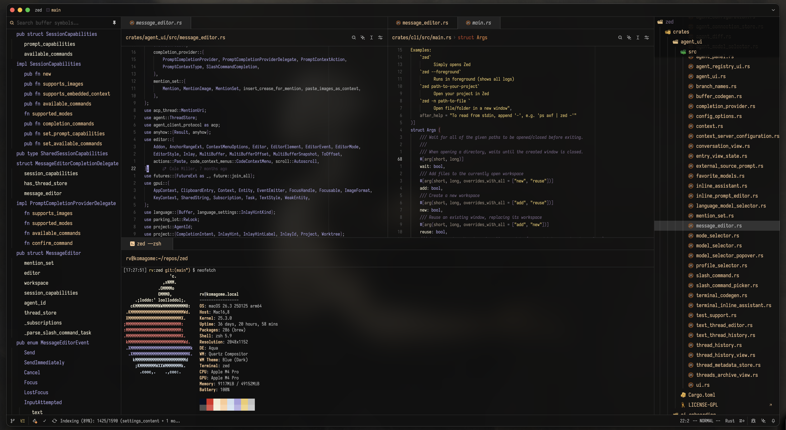
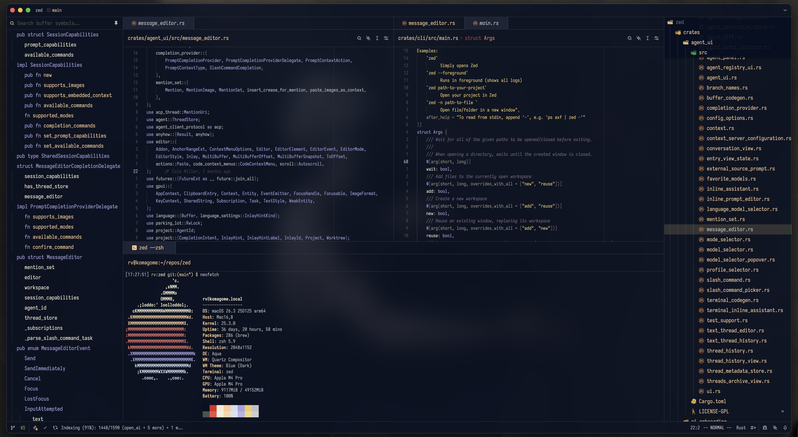
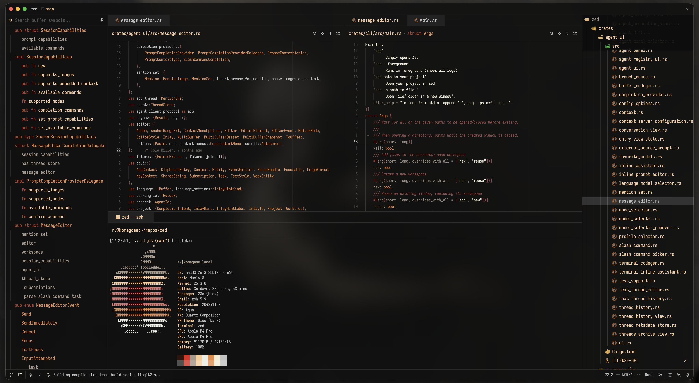
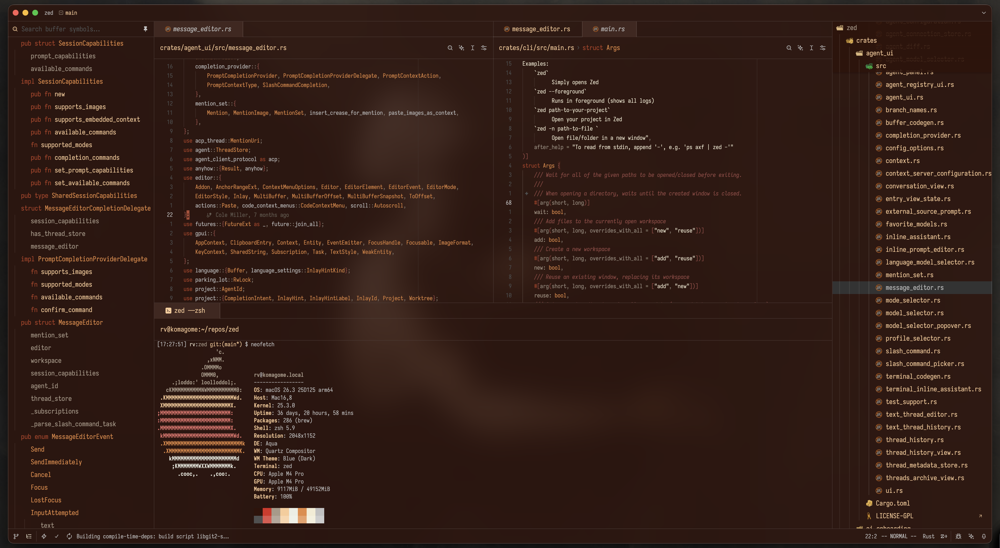
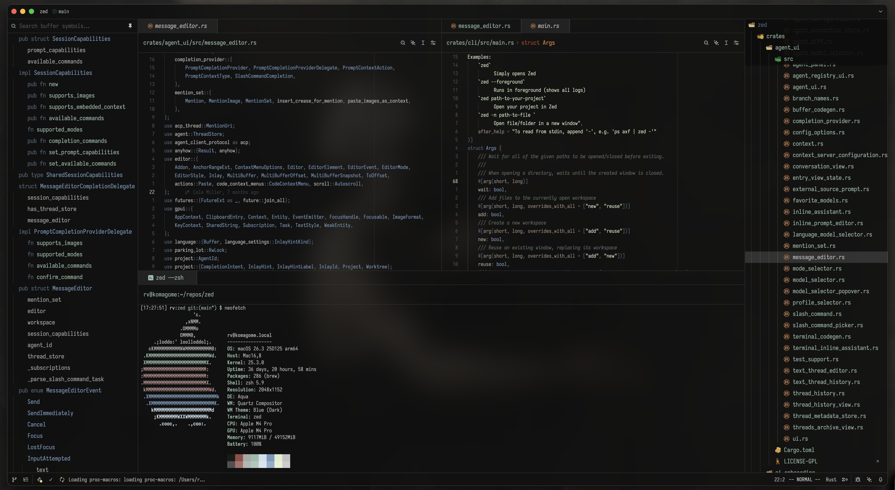
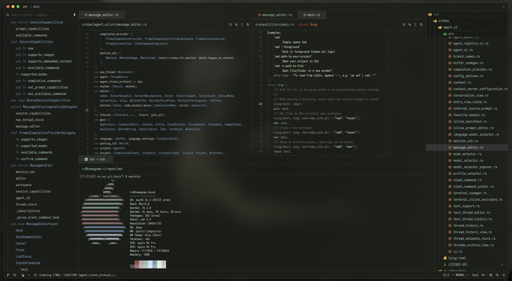
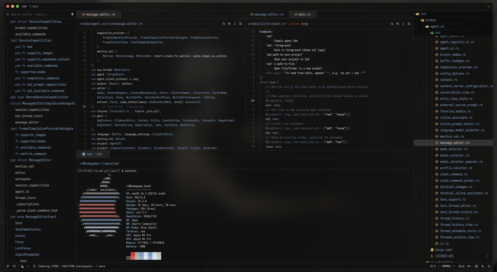
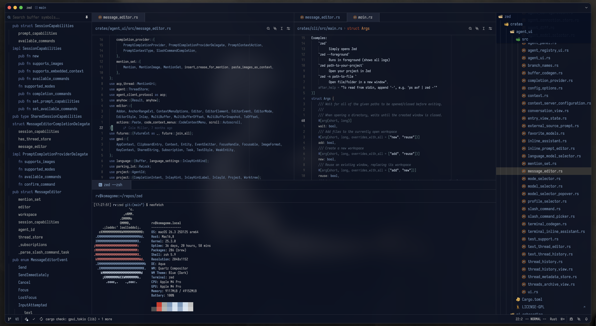
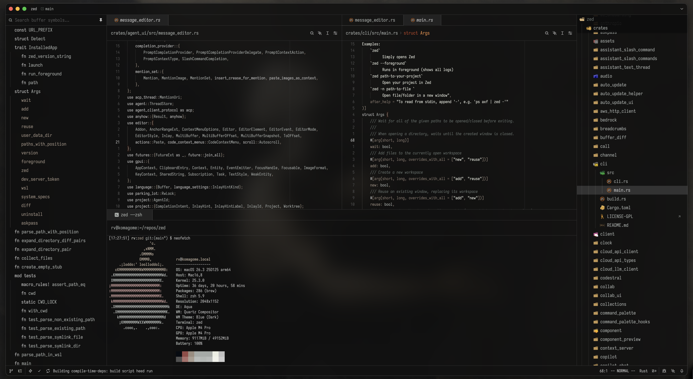
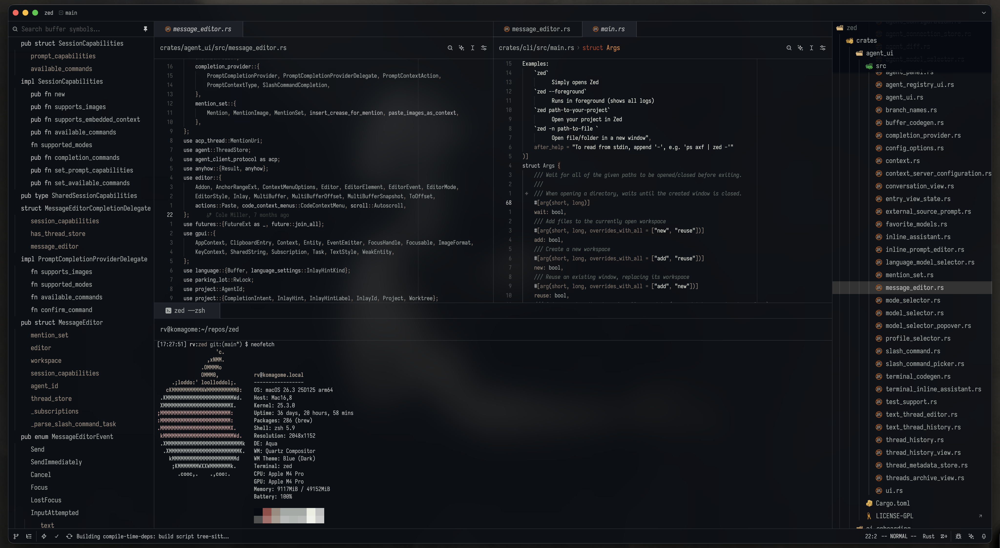

# Ars Goetia

Dark, transparent themes with blur for [Zed](https://zed.dev).

Five color palettes named after Gundam frames from Iron-Blooded Orphans, each with a frosted glass variant. All colors sourced from [black-metal-theme-neovim](https://github.com/metalelf0/black-metal-theme-neovim).

## Themes

Every theme comes in two modes:

- **Regular** --- neutral dark frosted glass
- **Alt** --- tinted frosted glass with a band-specific color

### Kimaris

Noble knight. Purple for structure, gold for content.

`#A8A1DE` lavender keywords | `#eecc6c` gold strings | `#e78a43` orange numbers | `#756482` dusty purple brackets

Alt tint: Dark Funeral midnight blue (`#060f23`)

### Barbatos

Savage berserker. Reds, rusts, oranges, golds.

`#B04024` rust keywords | `#f3ecd4` cream strings | `#e78a43` orange types | `#974b46` rust brackets

Alt tint: Thyrfing dark ember (`#31120a`)

### Gusion

Crude pirate. Sickly greens, slates, olives.

`#556677` slate keywords | `#ddeecc` pale green strings | `#7799bb` blue types | `#556677` slate brackets

Alt tint: Windir dark green (`#181c15`)

### Vidar

Cold avenger. Ice blues, moonlit slates, teal frost.

`#5E77A3` slate blue keywords | `#d0dfee` ice strings | `#7799bb` blue types | `#5f8787` teal brackets

Alt tint: Dark Funeral midnight blue (`#060f23`)

### Bael

The origin. Stripped to bone. Grays, taupes, near-whites.

`#c1c1c1` silver keywords | `#eceee3` off-white strings | `#a5aaa7` gray types | `#9b8d7f` taupe brackets

Alt tint: Marduk near-black blue (`#060b12`)

## Install

### From Zed Extensions (once published)

Open the command palette, search for "Ars Goetia", and install.

### Dev install

1. Clone this repo
2. In Zed, open the command palette and run **Extensions: Install Dev Extension**
3. Select the cloned directory

## Transparency

All themes use `background.appearance: blurred` with transparent editor, toolbar, tab, panel, and terminal backgrounds. The blur effect requires macOS.

### Opacity tiers

| Tier | Opacity | Usage |
|------|---------|-------|
| Clear | 0% | Editor, panels, toolbar, terminal |
| Edge | 13% | Borders, guides, separators |
| Soft | 33% | Search highlights, scrollbar, selections |
| Fill | 50% | Element backgrounds, subheaders |
| Hover | 67% | Hover and active states |
| Glass | 80% | Surface tint, status bar, title bar |
| Thick | 90% | Elevated surfaces, active tab, overlays |

## Color origins

Every syntax color traces back to a black metal band's album art palette:

| Band | Colors |
|------|--------|
| Bathory | `#fbcb97` tan, `#e78a43` orange |
| Burzum | `#ddeecc` pale green, `#99bbaa` sage |
| Darkthrone | `#FFFFFF` white |
| Dark Funeral | `#d0dfee` ice blue |
| Emperor | `#A8A1DE` lavender, `#756482` dusty purple |
| Gorgoroth | `#9b8d7f` taupe |
| Immortal | `#7799bb` blue, `#556677` slate |
| Impaled Nazarene | `#DC2A22` red, `#B29740` gold |
| Khold | `#eceee3` off-white, `#974b46` rust |
| Marduk | `#a5aaa7` gray, `#626b67` gray-green |
| Mayhem | `#f3ecd4` cream, `#eecc6c` gold |
| Nile | `#aa9988` tan, `#777755` olive |
| Taake | `#a29884` brown-gray, `#83756a` taupe |
| Thyrfing | `#B04024` rust, `#AF4C35` sienna |
| Venom | `#f8f7f2` off-white, `#fc302e` red |
| Windir | `#D9D98E` khaki, `#5E77A3` slate blue |

## License

MIT
